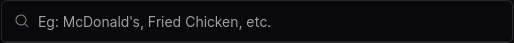
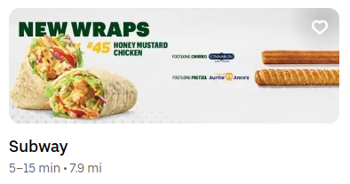
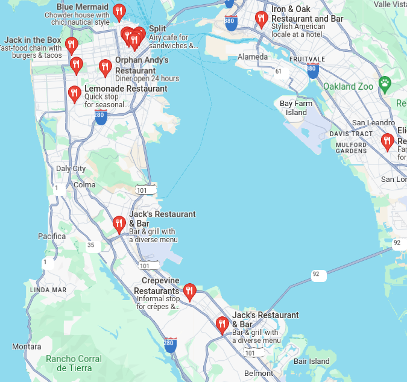
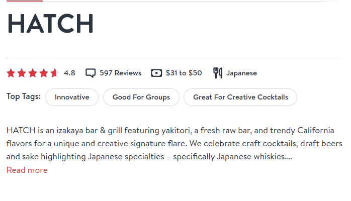

# 🍽️ Golden Plate Map

Welcome to the Golden Plate Map project!

Your task is to build a **web application** that allows users to **explore restaurants in California**.

- [🍽️ Golden Plate Map](#️-golden-plate-map)
  - [Getting Started](#getting-started)
    - [Pre-requisites](#pre-requisites)
    - [Create a Private fork](#create-a-private-fork)
    - [Install Dependencies](#install-dependencies)
    - [Start the Development Server](#start-the-development-server)
  - [Codebase](#codebase)
  - [Dataset](#dataset)
  - [Goals](#goals)
    - [Home Page (`/`)](#home-page-)
    - [Restaurant Page (`/restaurant/[restaurantId]`)](#restaurant-page-restaurantrestaurantid)
    - [Miscellaneous](#miscellaneous)
  - [Guidelines](#guidelines)
  - [Evaluation](#evaluation)
    - [Criteria](#criteria)
    - [Submission](#submission)
    - [Contact](#contact)

## Getting Started

### Pre-requisites

- [![Node.js]](https://nodejs.org/en/download) `v18` on your development machine.
- The [![pnpm]](https://pnpm.io/) package manager.
- A [![GitHub]](https://github.com) account.
- A [![Vercel]](https://vercel.com/home) account.

### Create a Private fork

Let's create a private fork of this repository:

- [Go to the "Import a repository" page on GitHub](https://github.com/new/import)
- Fill in the information as shown below:

  <p align="center">
    
    <p align="center">How to create a private fork</p>
  </p>

Once the repository is created on GitHub, clone it onto your local system!

> **Note**
> Use the url for this repository as the source url for the import.

### Install Dependencies

To install all necessary dependencies, run:

```bash
pnpm install
```

### Start the Development Server

Begin interacting with the project by starting the development server:

```bash
pnpm dev
```

If everything is set up correctly, you should see a prompt to visit `http://localhost:3000` in your browser.

> **Note**
> The development server is configured to automatically reload the application when changes are made to the codebase.
> As such, it can be a bit slow when using the app.
>
> To experience a much more performant version of the app, you can build the app using the following commands:
>
> ```bash
> pnpm build
> pnpm start
> ```

## Codebase

This repository serves as a starter template for the project.
It is built using the following technologies:

- [![Next.js]](https://nextjs.org) - a powerful app framework for the web
- [![React]](https://react.dev) - a JavaScript library for building user interfaces
- [![Tailwind]](https://tailwindcss.com) - a utility-first CSS framework for styling

## Dataset

Please download the dataset of restaurants in California from this [link](https://dotlas-marketing.s3.amazonaws.com/interviews/california_restaurants_2024.json).

> **Note**
> You may add the dataset to the project folder.
> However, avoid committing the dataset to the `git` repository.

## Goals

The goal of this project is to create a web application that allows users to explore the best restaurants in California.

### Home Page (`/`)

The primary goal of the home page is to provide users with the ability to find restaurants.

It should include the following features:

- A search input to find restaurants by name or cuisine:

  

- Based on the results returned by the search, a list of preview cards for the restaurants.

  - When no search query is provided, the list should display the top restaurants in California, determined by you.
  - Each card must contain the following details for each restaurant:
    - Name
    - Cuisine
    - Rating & Review count
    - Location / Area
    - Price range
  - Interacting with the card must allow the user to navigate to the restaurant's page.

  <p align="center">
    
    <p align="center">Example of a restaurant preview card on UberEats</p>
  </p>

  > **Note**
  > Do not imitate the above design from UberEats. You are free to design the preview card as you see fit.

- Display a map with markers for each restaurant returned by the search.

  <p align="center">
    
    <p align="center">A map of restaurants in San Francisco, California on Google Maps</p>
  </p>

  > **Note**
  > Do not imitate the above design from Google Maps. You are free to design the map as you see fit.

  - Clicking on a marker should zoom in on the restaurant's location and highlight/bring into view the preview card for that restaurant. (**BONUS**)

### Restaurant Page (`/restaurant/[restaurantId]`)

This page serves as the detailed view for a specific restaurant.

Include as many relevant details from the data set as possible, such as:

- Address
- Description
- Social Media
- Contact information
- Amenities
- Operating hours

<p align="center">
  
  <p align="center">An example restaurant page on OpenTable</p>
</p>

> **Note**
> Do not imitate the above design from OpenTable. You are free to design the restaurant page as you see fit.

### Miscellaneous

- An "I'm feeling lucky" button that randomly selects a restaurant for the user.
- A logo for the application. (**BONUS**)

## Guidelines

- You are free to use any libraries or tools that you are comfortable with, as long as they are compatible with the template's initial stack.
- The following UI component libraries (all compatible with Tailwind) are highly recommended for quick prototyping and development:
  - [`shadcn/ui`](https://ui.shadcn.com/)
  - [`headlessui`](https://headlessui.com/)
  - [`daisyUI`](https://daisyui.com/)
  - [`flowbite`](https://flowbite.com/)
- It is highly recommended to use the [![mapbox]](https://www.mapbox.com) package for maps.

  A React compatible libraary is already included in the project dependencies. Find more information on how use it [here](https://visgl.github.io/.react-map-gl/).

  You will need [an access token](https://visgl.github.io/react-map-gl/docs/get-started/mapbox-tokens) from Mapbox to use the library.

  Once you have an access token, create a `.env` file based on the [template](./.env.template).

  > **Note**
  > This `.env` file is already included in the `.gitignore` file, so you don't have to worry about accidentally committing it to the repository.

- If you are using VS Code as your text editor, consider installing the [recommended extensions](.vscode/extensions.json) for this project.
- Always keep your code well formatted. Your IDE should be configured to automatically format your code using [![Prettier]](https://prettier.io) but you can also run the following command:
  ```bash
  pnpm format
  ```
- Ensure that your code is free from common programming style issues by running the following command:
  ```bash
  pnpm lint
  ```
  This command runs [![ESLint]](https://eslint.org) on the codebase to catch any issues.
  Your IDE should also be configured to show ESLint warnings and errors.
- It is highly recommended to use services like GitHub Copilot, ChatGPT, etc., to speed up your development process.

## Evaluation

### Criteria

For the application:

- **Functionality**: Does the application meet the requirements of the project?
- **Familiarity**: Is the UI intuitive and easy to use? Is the application accessible?
- **Performance**: Does the application perform well? Are there any interactions that make the user wait a long time?
- **Creativity**: Does the application have a unique look and feel? Does it stand out from other similar applications?

For the codebase:

- **Readability**: Is the codebase well-structured and easy to understand?
- **Maintainability**: Is the codebase easy to maintain and extend by other developers?
- **Documentation**: Is the codebase well-documented? Are there comments where necessary?
- **Best Practices**: Does the codebase follow best practices for the technologies used?

### Submission

- Deploy the project on Vercel and ensure that it is publicly accessible.
- Set the deployment link as the website for this GitHub repository (the About section on the repository's homepage).
- [Invite us](#contact) as [collaborators to your private fork](https://docs.github.com/en/account-and-profile/setting-up-and-managing-your-personal-account-on-github/managing-access-to-your-personal-repositories/inviting-collaborators-to-a-personal-repository)

### Contact

Feel free to reach out to us, should you have any questions.

| Name            | Contact                                                                                            |
| :-------------- | :------------------------------------------------------------------------------------------------- |
| Kelvin DeCosta  | [![GitHub]](https://github.com/kelvindecosta) [![LinkedIn]](https://linkedin.com/in/kelvindecosta) |
| Eshwaran Venkat | [![GitHub]](https://github.com/cricksmaidiene) [![LinkedIn]](https://linkedin.com/in/eshwaranv98)  |

> Feel free to ping us anytime for support.

[Next.js]: https://img.shields.io/badge/next.js-000000?logo=nextdotjs&logoColor=white "Next.js"
[React]: https://img.shields.io/badge/react-20232A?logo=react&logoColor=61DAFB "React"
[Vercel]: https://img.shields.io/badge/vercel-000000?logo=vercel&logoColor=white "Vercel"
[TypeScript]: https://img.shields.io/badge/typescript-007ACC?logo=typescript&logoColor=white "TypeScript"
[ESLint]: https://img.shields.io/badge/eslint-3A33D1?logo=eslint&logoColor=white "ESLint"
[Prettier]: https://img.shields.io/badge/prettier-1A2C34?logo=prettier&logoColor=F7BA3E "Prettier"
[pnpm]: https://img.shields.io/badge/pnpm-F69220?logo=pnpm&logoColor=white "pnpm"
[Node.js]: https://img.shields.io/badge/node.js-339933?logo=node.js&logoColor=white "Node.js"
[GitHub]: https://img.shields.io/badge/github-181717?logo=github&logoColor=white "GitHub"
[Tailwind]: https://img.shields.io/badge/tailwind-38B2AC?logo=tailwind-css&logoColor=white "Tailwind CSS"
[mapbox]: https://img.shields.io/badge/mapbox-000000?logo=mapbox&logoColor=white "Mapbox"
[LinkedIn]: https://img.shields.io/badge/linkedin-0A66C2?logo=linkedin&logoColor=white "LinkedIn"
